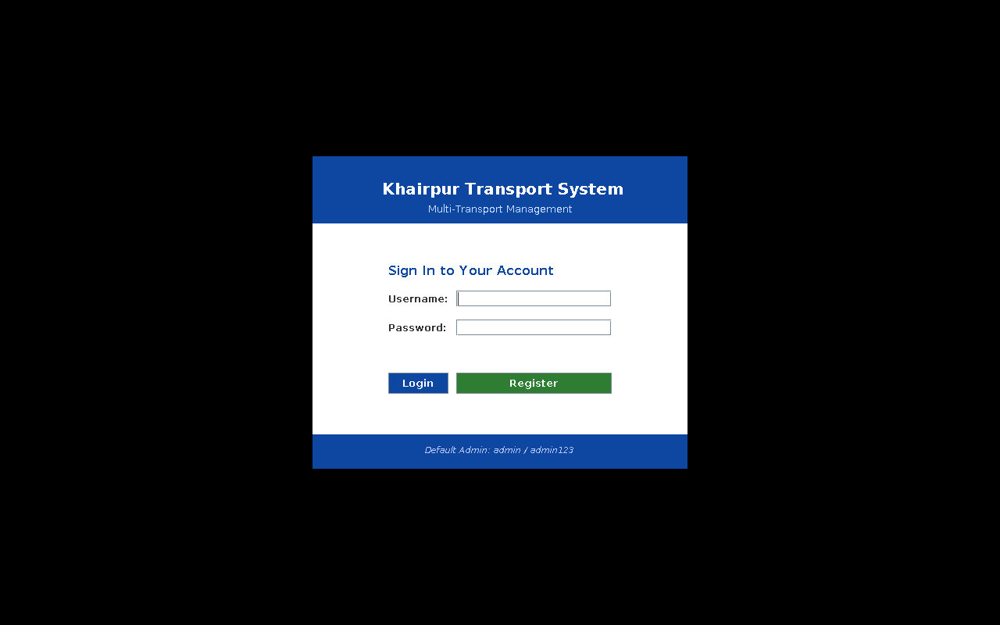
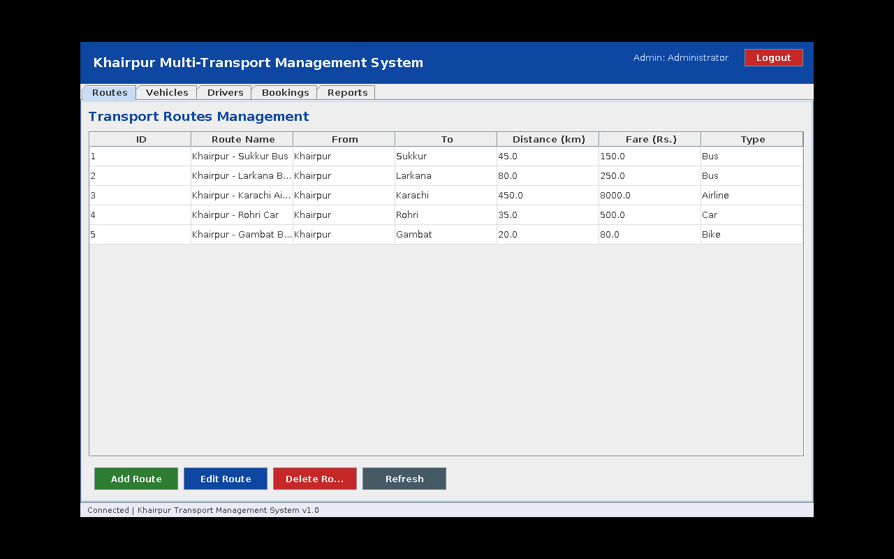
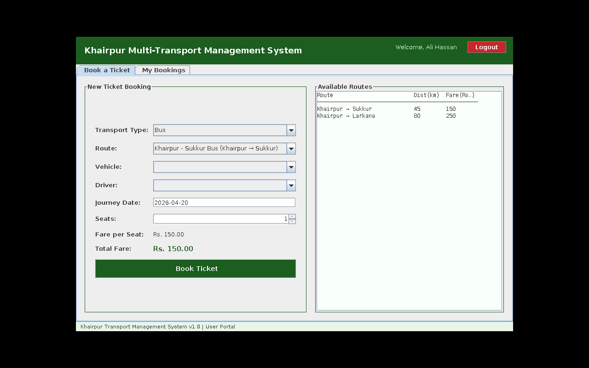

# KhairpurTransportSystem

A Java-based **Multi-Transport Management System** for Khairpur city, developed as an OOP course project at Mehran University of Engineering & Technology. Features Bus, Car, Bike, and Airline booking with Admin & User dashboards, full CRUD operations, reports, and ticket printing. Built with Java Swing (GUI), MySQL database, and MVC architecture.

## Screenshots

### Login Screen


### Admin Dashboard – Routes


### Admin Dashboard – Vehicle Fleet


### User Dashboard – Book a Ticket


---

## Features

- **Role-based Login** – Admin and User roles with separate dashboards
- **Admin Dashboard** with tabbed interface:
  - 🗺 **Routes** – Full CRUD for transport routes (Bus/Car/Bike/Airline)
  - 🚗 **Vehicles** – Full CRUD for the vehicle fleet with capacity and status tracking
  - 👤 **Drivers** – Full CRUD for drivers with licence number and vehicle type
  - 📋 **Bookings** – View all passenger bookings, mark complete, cancel, print passenger list
  - 📊 **Reports** – Live statistics: total bookings, revenue, breakdown by transport type
- **User Dashboard** with tabbed interface:
  - 🎫 **Book a Ticket** – Select transport type, route, vehicle, driver, journey date and seats
  - 📋 **My Bookings** – View personal bookings, cancel confirmed bookings, print ticket
- **Passenger List Printing** – Formatted printable list for all active bookings
- **Ticket Generation** – Individual printable ticket for each booking

---

## Project Structure (MVC Architecture)

```
src/main/java/com/khairpur/
├── Main.java                         # Application entry point
├── model/
│   ├── Person.java                   # Abstract base for User and Driver
│   ├── User.java                     # Admin/User account model
│   ├── Driver.java                   # Driver model
│   ├── Vehicle.java                  # Vehicle model
│   ├── TransportRoute.java           # Route model
│   └── Booking.java                  # Booking model
├── controller/
│   ├── UserController.java           # Auth, registration, user CRUD
│   ├── DriverController.java         # Driver CRUD
│   ├── VehicleController.java        # Vehicle CRUD
│   ├── RouteController.java          # Route CRUD
│   └── BookingController.java        # Booking creation and management
├── view/
│   ├── LoginForm.java                # Login screen + registration dialog
│   ├── AdminDashboard.java           # Admin main window (tabbed)
│   ├── UserDashboard.java            # User main window (tabbed)
│   ├── RoutePanel.java               # Routes management panel
│   ├── VehiclePanel.java             # Vehicles management panel
│   ├── DriverPanel.java              # Drivers management panel
│   ├── BookingListPanel.java         # All bookings + passenger list print
│   ├── ReportsPanel.java             # Statistics and reports
│   └── MyBookingsPanel.java          # User's bookings + ticket generation
└── util/
    └── DatabaseConnection.java       # MySQL JDBC singleton connection
```

---

## Prerequisites

| Requirement | Version |
|-------------|---------|
| Java JDK    | 11 or higher |
| Apache Maven | 3.6+  |
| MySQL       | 8.0+   |

---

## Setup & Installation

### 1. Clone the Repository
```bash
git clone https://github.com/AbdulRauf015/KhairpurTransportSystem.git
cd KhairpurTransportSystem
```

### 2. Set Up the Database
Start MySQL and run the schema script:
```bash
mysql -u root -p < sql/schema.sql
```
This creates the `khairpur_transport` database, all tables, and inserts sample data including:
- Default admin account (`admin` / `admin123`)
- 5 sample routes (Bus, Car, Bike, Airline)
- 5 sample vehicles
- 4 sample drivers

### 3. Configure Database Connection
Copy the example properties file and edit it with your MySQL credentials:
```bash
cp src/main/resources/database.properties.example src/main/resources/database.properties
```
Then edit `src/main/resources/database.properties`:
```properties
db.url=jdbc:mysql://localhost:3306/khairpur_transport?useSSL=false&allowPublicKeyRetrieval=true&serverTimezone=UTC
db.username=root
db.password=your_password_here
```
> **Note:** `database.properties` is excluded from version control via `.gitignore` to keep credentials out of the repository.

### 4. Build the Project
```bash
mvn package
```
This produces `target/KhairpurTransportSystem.jar` and copies the MySQL connector to `target/lib/`.

### 5. Run the Application
```bash
java -cp "target/KhairpurTransportSystem.jar:target/lib/*" com.khairpur.Main
```
On Windows use semicolons:
```cmd
java -cp "target\KhairpurTransportSystem.jar;target\lib\*" com.khairpur.Main
```

---

## Default Credentials

| Role  | Username | Password |
|-------|----------|----------|
| Admin | `admin`  | `admin123` |

New user accounts can be registered from the Login screen using the **Register** button.

---

## Database Schema

| Table      | Description                                    |
|------------|------------------------------------------------|
| `users`    | Admin and passenger accounts                   |
| `drivers`  | Driver records with licence and vehicle type   |
| `vehicles` | Fleet vehicles with type, capacity and status  |
| `routes`   | Transport routes with fare and distance        |
| `bookings` | Booking records linking users, routes, vehicles and drivers |

---

## Technologies Used

- **Java 11** – Core language
- **Java Swing** – GUI framework
- **MySQL 8** – Relational database
- **JDBC (com.mysql:mysql-connector-j 8.3.0)** – Database connectivity
- **Apache Maven** – Build and dependency management
- **MVC Pattern** – Architectural separation of concerns

